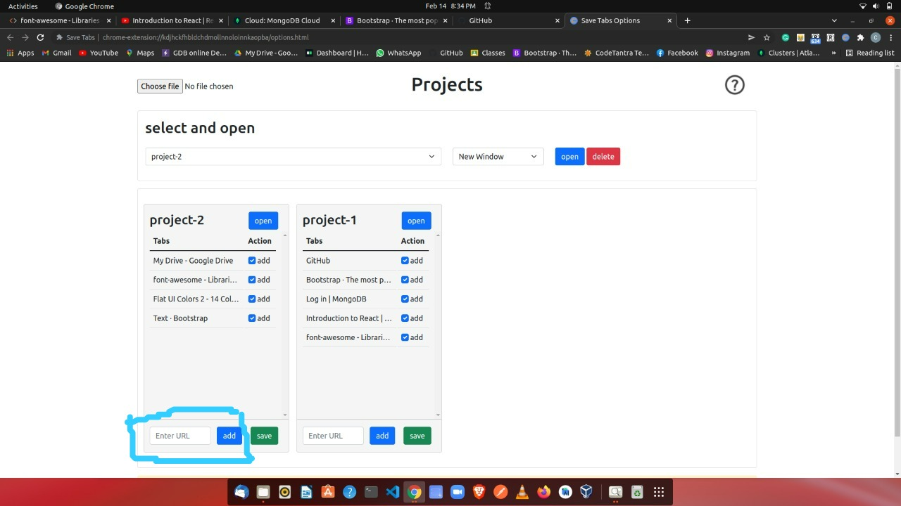

## SaveTabs - This extension save the tabs in your chrome browser for managing your work!

## How to add
- open extensions page of chrome by hitting this url - `chrome://extensions/`

- switch on developer mode

- click on Load unpacked button

- give path of the extension folder

- can pin the extension by clicking on extensions button on chrome

- open the popup page by clicking on extension icon.

- open the options page by right click on extension icon.

- open the help page in options to know, how to start.

## Work done
- save the selected open tabs in chrome by providing one group/project name.

- open all the selected tabs in current or new chrome window.

- add new tabs in one group/project in options page.

- delete the group/project.

- export/import the data while removing/adding this chrome extension.

## Screenshots

